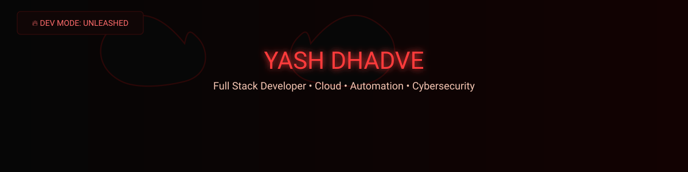

  

  

  <h1>Yash Dhadve</h1>
  <strong>Full Stack Developer • Cloud • Automation • Cybersecurity</strong>

  

    Forging reliable full-stack systems with Django, Python, and pragmatic frontend tooling. Technical, tactical, and focused on production-ready delivery.
  

  

    
    
    
    
  

  

## 🔥 ABOUT THE DEVIL

I'm Yash Dhadve — a developer from Pune, Maharashtra, building practical web and Python solutions with a strong focus on backend systems, clean interfaces, and cloud-ready deployment.

- Web Developer and Python Developer
- Hands-on with full-stack web apps using Django, HTML, CSS, JavaScript, and Bootstrap
- Comfortable across backend development, database design, and cloud deployment
- Currently pursuing M.Sc. Computer Science at Kaveri College of Arts, Science, and Commerce
- Completed B.Sc. Computer Science from the same institution
- Experience includes a Python Developer internship at Codtech IT Solutions Pvt. Ltd.

## 🔧 CURRENTLY FORGING

- Building `LARA` — an autonomous reasoning agent for planning, tool execution, and real-world system interaction
- Strengthening full-stack project delivery with Django-based applications
- Exploring automation, cloud deployment, and product-oriented development workflows

## ⚔️ MY WEAPONS

### Languages

  
  
  

### Frontend

  
  
  
  

### Backend

  
  

### Databases

  
  
  

### Cloud / DevOps

  
  
  

### Tools

  
  
  

## 💀 FORGED PROJECTS

<table>
  <tr>
    <td valign="top" width="50%">
      <strong>Stock Data Analysis &amp; Visualization Platform</strong> 
      Django-based stock market analysis platform using Supabase, yfinance, and OTP authentication through Google SMTP.  
      <strong>Stack:</strong> Django, PostgreSQL, Supabase, yfinance, SMTP
    </td>
    <td valign="top" width="50%">
      <strong>QuickQR</strong> 
      Responsive QR code generator with URL validation, instant generation, download support, history tracking, and dark/light mode.  
      <strong>Stack:</strong> HTML, CSS, JavaScript
    </td>
  </tr>
  <tr>
    <td valign="top" width="50%">
      <strong>LARA</strong> 
      Ongoing autonomous reasoning agent focused on planning, tool execution, and real-world system interaction using local LLMs and automation frameworks.  
      <strong>Stack:</strong> Python, local LLMs, automation frameworks
    </td>
    <td valign="top" width="50%">
      <strong>Plants World</strong> 
      Plant e-commerce UI with product listings, categories, gallery views, and form interfaces. Live project available below.  
      <strong>Stack:</strong> Figma, HTML, CSS, JavaScript 
      <strong>Live:</strong> <a href="https://yash-dhadve.github.io/PlantWorld/">Plant World</a>
    </td>
  </tr>
</table>

## 📊 GITHUB INFERNO

  

  
  

  

## 🐍 CONTRIBUTION HELL

  

## 📡 SUMMON ME

  
  
  
  

  

  <strong>Dark. Powerful. Technical. Mysterious. Built to ship.</strong>

